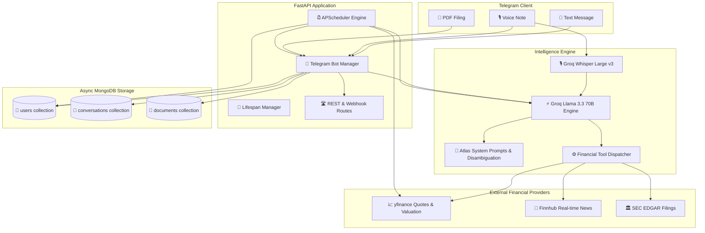

# 🏛️ Atlas AI Financial Assistant


> **Production-Ready, Zero-Command Telegram AI Agent for Investment Professionals**  
> Powered by **FastAPI**, **MongoDB (motor)**, **Groq AI (Llama 3.3 70B & Whisper Large v3)**, **yfinance**, **Finnhub**, and **APScheduler**. Built on a **100% Free Tier** stack.

---

## 📑 Table of Contents
- [Executive Overview](#-executive-overview)
- [System Architecture](#-system-architecture)
- [Core Design Principles](#-core-design-principles)
- [Database Schema (MongoDB)](#-database-schema-mongodb)
- [Financial Tool Bindings](#-financial-tool-bindings)
- [Multimodal Intelligence (Voice & PDF)](#-multimodal-intelligence-voice--pdf)
- [Proactive Engine & Background Jobs](#-proactive-engine--background-jobs)
- [Quickstart & Setup Guide](#-quickstart--setup-guide)
- [API Reference](#-api-reference)

---

## 🌟 Executive Overview

**Atlas** is an autonomous financial assistant designed specifically for equity research analysts, portfolio managers, investment bankers, and active traders. Unlike traditional command-driven bots with rigid menus and slash commands, Atlas operates purely through fluid natural conversation, voice notes, and document intelligence powered by **Groq's ultra-low latency LPU inference engine**.

### Key Capabilities
- **Ultra-Fast Market Reasoning:** Leverages Groq's `llama-3.3-70b-versatile` for instantaneous multi-step financial analysis and function calling.
- **Real-Time Market Quotes & Valuation:** Pulls live pricing, 52-week ranges, forward P/E, PEG ratios, EV/EBITDA, and revenue growth via `yfinance`.
- **Multimodal Document RAG:** Ingests earnings reports, 10-K/10-Q filings, and PDF decks, allowing users to ask natural questions (e.g., *"Summarize the top risks on page 4"*).
- **Whisper Audio Intelligence:** Near-instantaneous voice note transcription with Groq's `whisper-large-v3` coupled with immediate financial synthesis.
- **Proactive Morning Intelligence:** Pushes personalized daily morning briefs tailored to user watchlists at 8:00 AM user local time.
- **Silence is Golden Intraday Alerts:** Scans user watchlists hourly and only sends high-priority alerts if a stock swings > 5%, avoiding market noise.

---

## 🏗️ System Architecture



---

## 🎯 Core Design Principles

1. **Zero-Command UI:** No slash commands (`/help`, `/quote`, `/news`), inline buttons, or rigid menus. Users interact as they would with a senior equity analyst.
2. **Conversational Disambiguation:** When asked open-ended questions like *"How is Apple doing?"*, Atlas provides an immediate snapshot and intelligently asks whether the user wants technical momentum, fundamental multiples, or recent news.
3. **Proactive, Not Passive:** Atlas tracks watchlists in MongoDB and actively compiles tailored morning intelligence briefs.
4. **Silence is Golden:** If a scheduled alert checks the market and finds nothing significant (<5% swing), it stays silent rather than sending spam.

---

## 🗄️ Database Schema (MongoDB)

All database operations are asynchronous using `motor`:

### 1. `users` Collection
* **Index:** `telegram_id` (Unique)
```json
{
  "telegram_id": 123456789,
  "role": "Senior Equity Analyst",
  "industries_followed": ["Semiconductors", "Cloud Infrastructure"],
  "watchlists": ["NVDA", "TSM", "AAPL", "MSFT"],
  "notification_schedule": {
    "brief_time": "08:00",
    "timezone": "America/New_York",
    "morning_brief_enabled": true,
    "market_alerts_enabled": true,
    "last_brief_sent_at": "2026-08-05T08:00:00Z",
    "last_alert_sent_at": null
  },
  "is_onboarded": true,
  "created_at": "2026-08-05T00:00:00Z"
}
```

### 2. `conversations` Collection
* **Index:** `(telegram_id, timestamp DESC)` (Fast retrieval of last 10 messages for context window injection; capped to 50 total records per user)
```json
{
  "telegram_id": 123456789,
  "role": "user",
  "content": "What is the forward P/E and margin trajectory for Nvidia?",
  "timestamp": "2026-08-05T14:30:00Z",
  "metadata": {}
}
```

### 3. `documents` Collection
* **Index:** `(telegram_id, document_id)`
```json
{
  "telegram_id": 123456789,
  "document_id": "AgACAgIAAxkBAAI...",
  "file_name": "NVDA_Q3_Earnings.pdf",
  "file_size_bytes": 1048576,
  "extracted_text_summary": "Executive summary of Q3 financial results...",
  "full_text_chunks": ["chunk 1...", "chunk 2..."],
  "upload_date": "2026-08-05T15:00:00Z"
}
```

---

## 🛠️ Financial Tool Bindings

Atlas is equipped with executable Python tools registered with Groq function calling:

| Tool Function | Description | Provider |
| :--- | :--- | :--- |
| `get_stock_price(ticker)` | Live quote, daily change %, volume, day range | `yfinance` |
| `get_financial_summary(ticker)` | P/E, Forward P/E, Market Cap, Revenue Growth, Margins | `yfinance` |
| `get_company_news(ticker, limit)` | Breaking headlines, company news, and catalysts | `Finnhub` / `Yahoo` |
| `get_market_news(category)` | Macro and overall market headlines | `Finnhub` |
| `get_sec_filings(ticker)` | Recent official 10-K, 10-Q, 8-K filings with direct links | `SEC EDGAR API` |
| `manage_watchlist(action, ticker)`| Dynamically add/remove tickers in user's profile | `MongoDB` |
| `update_user_preferences(...)` | Update role, sectors, and morning brief delivery time | `MongoDB` |

---

## 🎙️ Multimodal Intelligence (Photos/Charts, Voice & PDF)

- **Photos & Financial Charts (Groq Vision):** Send screenshots of technical charts (TradingView, Bloomberg, Yahoo Finance), financial statements, balance sheets, or news clippings. Groq Vision (`llama-3.2-11b-vision-preview`) identifies key support/resistance levels, trend patterns, technical indicators, and fundamental metrics with crisp executive takeaways.
- **Voice Notes (Groq Whisper):** Financial professionals on the go can send natural voice notes. Groq transcribes audio in milliseconds using `whisper-large-v3` and feeds the text directly into the Llama 3.3 financial reasoning loop.
- **PDF Filings:** Upload any quarterly earnings release, 10-K/10-Q, or investor presentation. Atlas parses the document, creates indexed semantic chunks, and enables conversational deep-dive Q&A.

---

## ⏰ Proactive Engine & Background Jobs

Powered by `APScheduler`:
1. **Morning Briefs:** Evaluates user local time every 15 minutes. When `brief_time` is reached (e.g. 08:00), fetches live quotes for all watchlist tickers, grabs top news, and pushes an executive 3-part Markdown brief synthesized via Groq.
2. **Volatility Scanner:** Scans watched stocks hourly. If a stock moves by more than `MARKET_ALERT_THRESHOLD_PCT` (default 5.0%), fetches the breaking catalyst and alerts the user instantly.

---

## 🚀 Quickstart & Setup Guide

### 1. Prerequisites
- Python 3.10+
- MongoDB instance (local or free MongoDB Atlas cluster)
- Telegram Bot Token from [@BotFather](https://t.me/botfather)
- Groq API Key from [Groq Console](https://console.groq.com/) (Free tier)
- Finnhub API Key from [Finnhub.io](https://finnhub.io/) (Free tier)

### 2. Installation
```bash
# Clone or navigate to the repository
cd "D:\assesment project"

# Install dependencies
pip install -r requirements.txt
```

### 3. Configure Environment Variables
Copy `.env.example` to `.env` and fill in your API credentials:
```ini
TELEGRAM_BOT_TOKEN="your_telegram_bot_token_here"
GROQ_API_KEY="your_groq_api_key_here"
GROQ_MODEL="llama-3.3-70b-versatile"
GROQ_AUDIO_MODEL="whisper-large-v3"
FINNHUB_API_KEY="your_finnhub_api_key_here"
MONGODB_URI="mongodb://localhost:27017"
TELEGRAM_MODE="polling"
```

### 4. Run the Server & Bot
```bash
python main.py
```
Or with uvicorn:
```bash
uvicorn main:app --host 0.0.0.0 --port 8000 --reload
```

---

## 🌐 API Reference

Interactive Swagger docs are available at `http://localhost:8000/docs`.

- `GET /health` - Diagnostic health check for DB, Bot, Groq AI, and Scheduler.
- `GET /api/v1/users` - View registered users and watchlists.
- `POST /api/v1/trigger-brief/{telegram_id}` - Manually trigger morning brief push for testing.
- `POST /api/v1/trigger-volatility-scan` - Manually execute the volatility scanner.
- `GET /api/v1/financial/quote/{ticker}` - Direct quote test endpoint.
- `GET /api/v1/financial/summary/{ticker}` - Fundamental valuation test endpoint.

